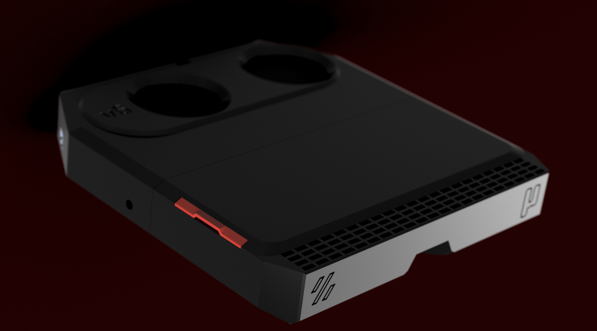

# Nevermore Micro V6

Nevermore Micro V6 is here! It is designed to supersede both the V4 and V5 duos, which will soon be considered legacy designs.

## What's New?

- **Intact 5015 Fans:** V6 requires the use of intact 5015 fans, eliminating the need to cut into the fan scroll or any wires. This innovation raises a common concern: does it waste carbon if the air isn't spread over the entire filter? The answer would be yes. However, we have overcome this challenge through the use of evasees and vanes to efficiently distribute the airflow within the small plenum space. This means all the carbon receives airflow immediately, without requiring any fan modifications.

- **Enhanced Heat Tolerance:** Unlike its predecessors, V6 can tolerate higher levels of heat. The V4 and V5 had thinner lids that could bend or warp, especially when subjected to temperatures above 100°C under a heated bed. This sometimes resulted in broken or damaged units. However, the V6 is beefed up to address this issue. With a thicker frame, structured vanes, and lids strategically placed away from the heat source, the chances of melting a Nevermore Micro are significantly reduced.

- **Improved Airflow:** V6 boasts superior airflow. We have achieved this by optimizing the printing direction, which allows for built-in seals. Say goodbye to air leaks between the cartridge and the plenum! Furthermore, the intake system has been redesigned to accommodate increased airflow. Now, it can process the chamber volume of a 250 Voron in just 30 seconds, and a larger 350 in approximately 2 minutes.

- **Reduced Noise:** V6 generates less noise compared to the V5, thanks to a redesigned air intake.

- **Compatibility:** V6 can be used with any machine, including a small Voron v0!

- **Sleek Design:** V6 not only performs exceptionally but also looks awesome. It features a novel jalousie lid design with no bolts, allowing for convenient one-handed carbon swaps. Gone are the days of dealing with annoying bolts or latches when swapping carbon. Rest assured, this design remains super secure. You have to try it to believe it!

For more information and documentation, visit our [GitHub page](https://github.com/nevermore3d).
